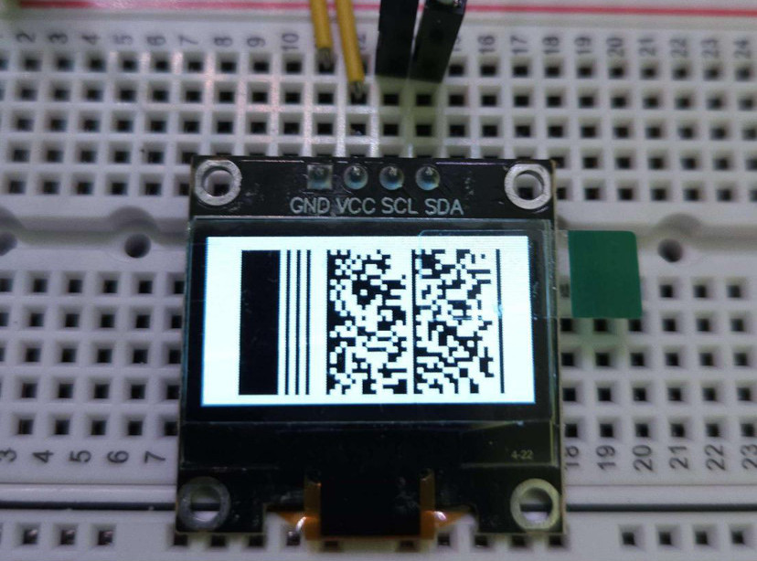

[](https://crates.io/crates/pdf417)



# PDF417 Barcode generator

A no-std and no-alloc PDF417 encoder for embedded applications (also works for
std). This library implements mutliple encoding modes for numbers, strings and
bytes according to the specification. You can also customize the rendering of
the barcodes (size, storage and inverted) and supports both Truncated PDF417
and MicroPDF417.

## Usage

### Installation

**pdf417** is available on [crates.io](https://crates.io/crates/pdf417)

Use the cargo add command:
```shell
cargo add pdf417
```

or add the crate in your Cargo.toml:
```toml
[dependencies]
pdf417 = "0"
```

### Generating a PDF417

Before you can generate a PDF417 barcode you should consider:

1. The **capacity** of the barcode (maximum number of codewords).
3. The **level** of error correction (0-8)
2. The **dimensions** of the barcode (number of rows and columns)

Here is an no-std and no alloc example to generate a PDF417 barcode:

```rust
use pdf417::*;

const COLS: u8 = 3;
const ROWS: u8 = 5;
const WIDTH: usize = pdf417_width!(COLS);
const HEIGHT: usize = pdf417_height!(ROWS);

// High-level encoding
let mut input = [0u16; (ROWS * COLS) as usize];
let (level, _) = PDF417Encoder::new(&mut input, false)
    .append_ascii("Hello, world!").fit_seal().unwrap();

// Rendering
let mut storage = [false; WIDTH * HEIGHT];
PDF417::new(&input, ROWS, COLS, level).render(&mut storage[..]);
```

> If you need a bigger barcode, you can control the size of the modules (see the
> documentation) using the pdf417_width and pdf417_height macros.

### Data Segments

You can multiple data segments (aka encoding modes) on a single barcode. The
available types are:
- **numeric**: efficient encoding of 44+ digit numbers
- **ascii**: efficient encoding of text (alphanumeric + punctuation) with
    support for non-displyable ASCII values which are encoded as raw bytes.
- **bytes**: binary data as bytes

An additional **UTF-8** mode is available which allows encoding of UTF-8 strings
using an ECI identifier and byte encoding mode (note that this encoding takes
significantly more space than the ASCII mode).

> See the different methods available on `PDF417Encoder` struct.

## Documentation

More documentation is available at [docs.rs](https://docs.rs/pdf417).

## Contribution & Feedback

If you have any feedback, please open an issue. If you encounter any bugs or unwanted behaviour, please open an issue.

This projet is open to contributions, feel free to submit your pull requests!

# License

pdf417 is available under the MIT license. See the LICENSE file for more info.
